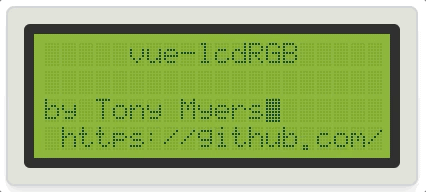
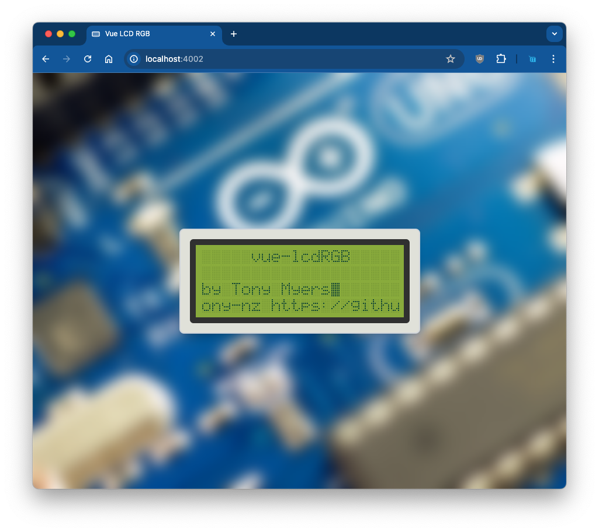

<br/>
<p align="center">
  <a href="https://github.com/tony-nz/vue-lcdRGB">
    
  </a>

  <h3 align="center">Vue LCD RGB</h3>

  <p align="center">
    Vue.js RGB LCD Screen Component for Customizable Visuals
    <br/>
    <br/>
    <a href="https://github.com/tony-nz/vue-lcdRGB"><strong>Explore the docs »</strong></a>
    <br/>
    <br/>
    <a href="https://vue-lcdRGB.netlify.app/" _target="blank">View Demo</a>
    .
    <a href="https://github.com/tony-nz/vue-lcdRGB/issues">Report Bug</a>
    .
    <a href="https://github.com/tony-nz/vue-lcdRGB/issues">Request Feature</a>
  </p>
</p>

## Table Of Contents

- [About the Project](#about-the-project)
  - [Features](#features)
- [Getting Started](#getting-started)
- [Usage](#usage)
- [License](#license)

## About The Project



Customize visual displays in Vue.js effortlessly with the RGB LCD Screen Component. Perfect for dynamic user interfaces, it offers flexible options for color and pixel settings, enhancing your project with vibrant visuals and ease of integration. Ideal for diverse applications from dashboards to creative displays, it simplifies the process of creating engaging Vue.js interfaces.

#### Features

- Customizable Colors: Set background, border, and pixel colors to suit your design needs.
- Text Writing: Write text onto the LCD screen with adjustable row positioning.
- Blinking Effects: Create blinking animations for pixels or text to draw attention.
- Text Rotation: Rotate text within specified rows for dynamic display updates.
- Flexible Configuration: Options for adjusting pixel size, border size, and number of rows and columns.
- Text Centering: Center-align text within the LCD screen rows for balanced and visually appealing displays.

## Getting Started

This is an example of how to list things you need to use the software and how to install them.

```sh
npm install npm@latest -g
```

```sh
npm run dev
```

###

## Usage

```js
<lcdRGB ref="lcdRGB" :options="options" />
```

```js
  setup() {
    const lcdRGB: any = ref(null);

    /**
     * Options for the LCD screen
     */
    const options: Options = {
      backgroundColor: "#87ad34",
      borderColor: "#303030",
      borderSize: "10px",
      columns: 20,
      pixelOffColor: "#7b9f31",
      pixelOnColor: "#0b4233",
      pixelSize: 2,
      rows: 4,
    };

    onMounted(() => {
      if (lcdRGB.value) {
        lcdRGB.value.writeText("lcdScreen", 0);
        lcdRGB.value.blink(true, 0, 0);
        lcdRGB.value.rotateRow("Hello this is some long text ", 1, 500);
      }
    });

    return {
      lcdRGB,
      options,
    };
  },
```

## License

Distributed under the MIT License. See [LICENSE](https://github.com/tony-nz/vue-rgbLCD/blob/main/LICENSE.md) for more information.
